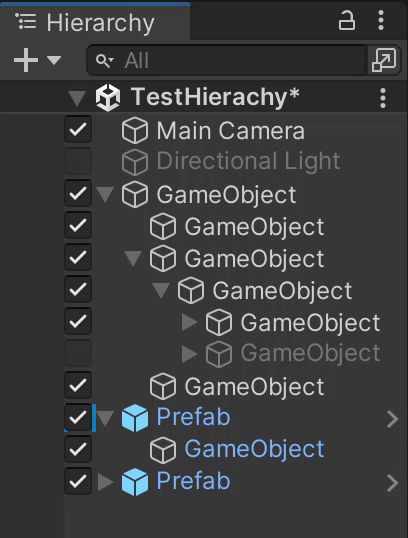

= Hierarchy Gameobject Active Toggle (Unity)

This package adds buttons to enable/disable gameobjects directly from the hierarchy.

ifdef::env-github[]
++++

  

++++
endif::[]

ifndef::env-github[]

endif::[]

(Probably also works in other unity versions. I just have only tested it in 2022.3)

== Setup
Installation by using the Package Manager:

. Click on the `+` in the `Package Manager` window
. Chose `Add package from git URL...`
. Insert the following URL `https://github.com/JonasWischeropp/unity_hierarchy_active_toggle.git`
. Press the `Add`-Button

If necessary more information can be found link:https://docs.unity3d.com/Manual/upm-ui-giturl.html[here].